# ILAIOS — AUTONOMOUS NODE ARCHITECTURE

**Document Type:** Canonical Autonomous Node / Execution Topology  
**Format:** GitHub Markdown + Mermaid  
**Status:** Proposed Canonical Companion to `SYSTEM_ARCHITECTURE.md`  
**Purpose:** Show how ILAIOS components connect, delegate, execute, validate, repair, checkpoint, and complete work as an autonomous governed system.  
**Core Principle:** **SIGN IN → ONE PROMPT → GOVERNED AUTONOMOUS EXECUTION → VERIFIED FINISHED PRODUCT**  
**Authority Rule:** This document visualizes node relationships and autonomous execution topology. It does not override `SYSTEM_ARCHITECTURE.md`; any conflict must be resolved in favor of the canonical system architecture.

---

# 00. Reading Model

This document is intentionally **node-first**.

Each node represents one bounded responsibility in the ILAIOS system.

A node may:

- receive a typed input;
- make a bounded decision;
- emit a typed output;
- create evidence;
- update execution state;
- request another governed node;
- pause for approval;
- fail closed;
- resume from checkpoint.

A node may **not** silently create new authority.

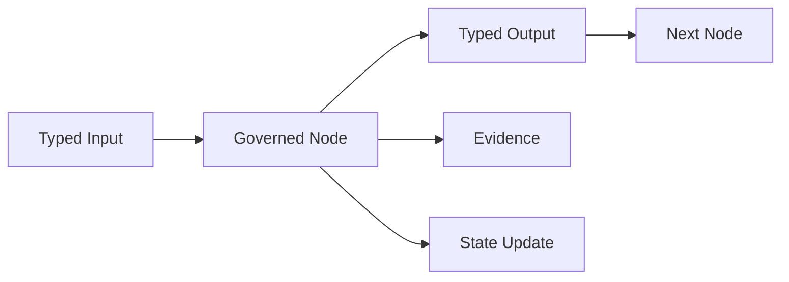

## Global Node Invariants

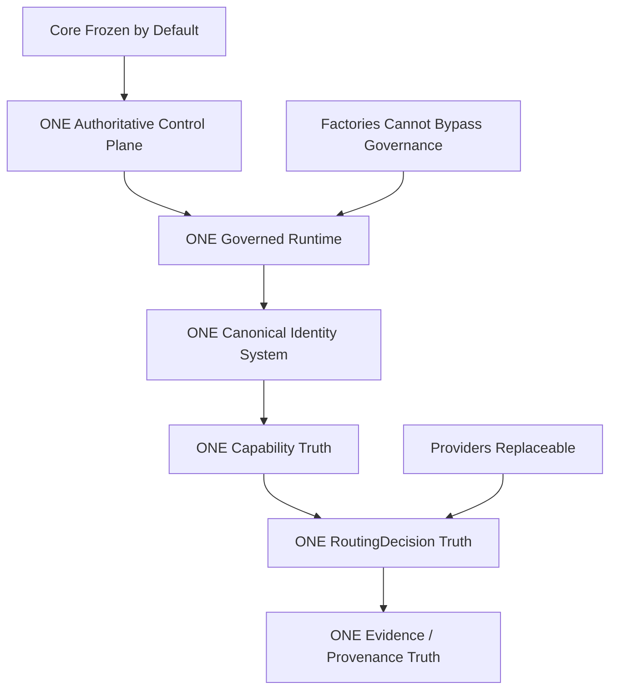

**Forbidden:** second Core, second Planner, second routing authority, second capability registry, factory-specific hidden runtime, self-approved privileged action, uncontrolled retry loop, direct factory-to-provider bypass.

---

# 01. Full Autonomous Node Topology

This is the primary node view of ILAIOS.

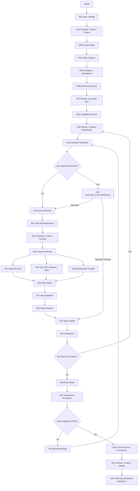

---

# 02. Autonomous Control Loop

ILAIOS autonomy is not an infinite agent loop. It is a bounded control loop.

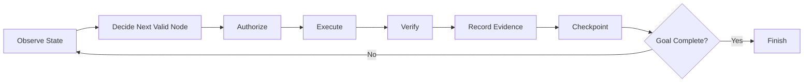

## Autonomous Loop Rules

- Every loop iteration must be attached to a known `GoalSpec`.
- Every execution must be bounded by policy, permissions, cost, time, and retry limits.
- Every material execution emits evidence.
- Every resumable execution updates durable state.
- `Goal Complete?` is determined by acceptance criteria, not by an agent claiming completion.
- A failed verification may trigger bounded repair, never unbounded self-retry.

---

# 03. Control Plane Node Graph

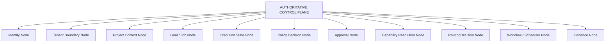

## Control Plane Ownership

The Control Plane owns **authority and state**, not every domain implementation.

It is the source of truth for:

- who is acting;
- for which tenant/project;
- what goal is active;
- which plan is authorized;
- which state the job is in;
- whether execution is permitted;
- whether approval is required;
- which route was chosen;
- what evidence was recorded.

---

# 04. Constitutional Core vs Governed Capability Nodes

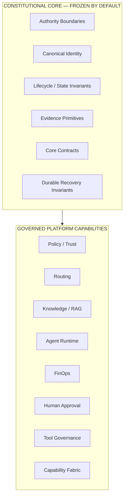

## Core Evolution Rule

**CORE = FROZEN BY DEFAULT, EVOLVABLE BY PROOF.**

A Core change is permitted only when a platform-wide invariant or canonical contract cannot be correctly implemented inside an existing governed capability boundary.

The following do **not** justify a Core change by themselves:

- a new provider;
- a new model;
- a new factory;
- a new skill;
- a new UI;
- a new open-source reference;
- a new domain-specific workflow.

---

# 05. Intent → Goal → DAG Node Chain

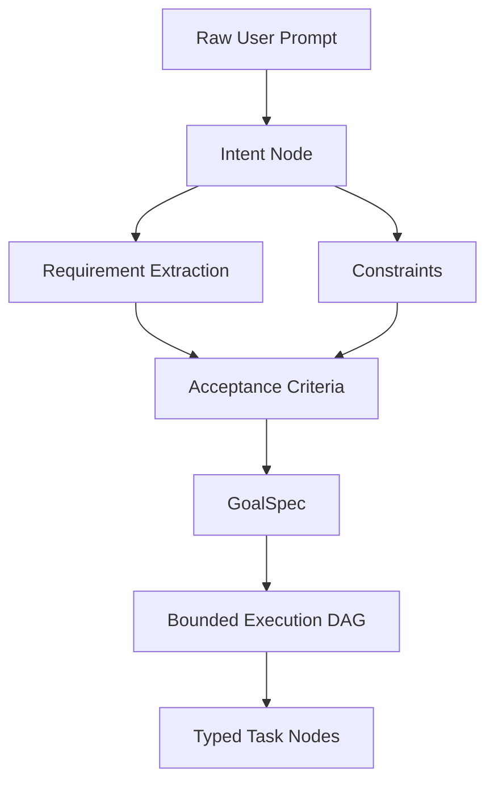

## Invariants

- Planning does not itself grant execution permission.
- A DAG must be acyclic and bounded.
- Every task node must have a stable identity.
- Every task node declares dependencies.
- Acceptance criteria exist before final verification.
- Planner cannot silently redefine the user's authorized goal.

---

# 06. Authorized Context / Memory / RAG Node Network

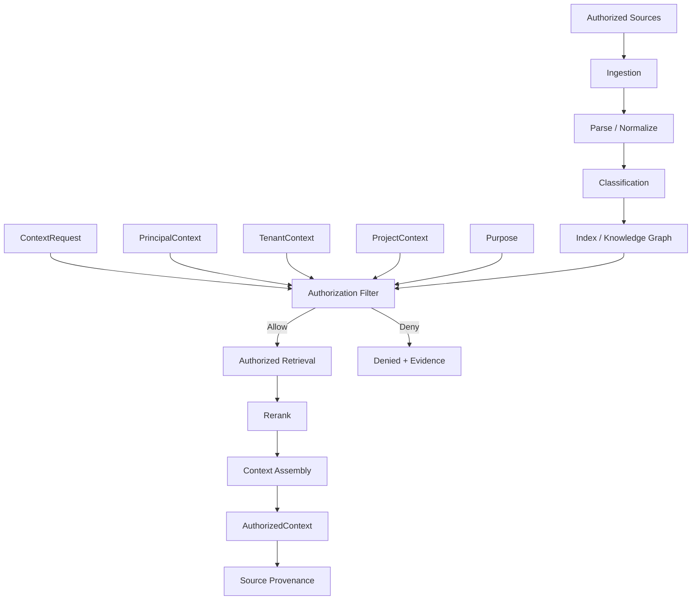

## Critical Rule

**Retrieval is an authorized action.**

A retrieved unit must preserve enough metadata to enforce:

- tenant;
- principal;
- project;
- classification;
- purpose;
- region;
- retention;
- authorization;
- provenance.

---

# 07. Capability Resolution Node Graph

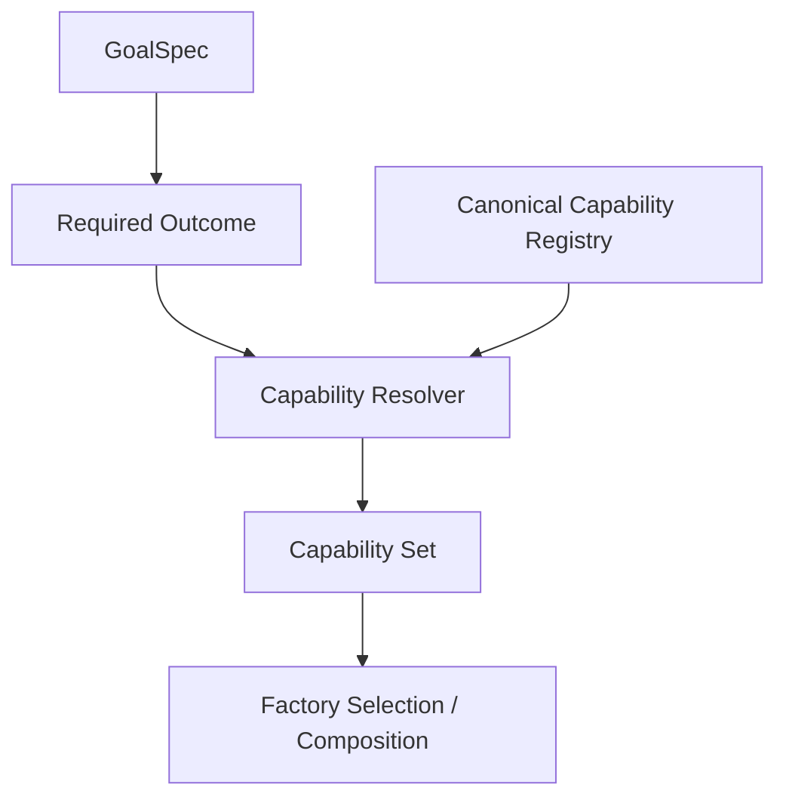

## Capability Node Rule

A capability answers:

> **What can ILAIOS do?**

A capability does not automatically create:

- a new agent;
- a new worker;
- a new provider;
- a new runtime.

---

# 08. Factory / Domain Orchestration Nodes

A Factory is a bounded domain DAG that composes capabilities into a finished product.

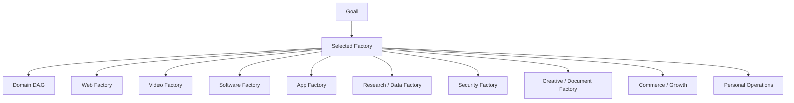

## Factory Invariants

- Factory ≠ Core.
- Factory ≠ Agent.
- Factory ≠ Worker.
- Factory ≠ Provider.
- Factory cannot create its own routing authority.
- Factory cannot bypass Policy Gateway.
- Factory cannot bypass Evidence.
- Factory cannot directly gain secrets.
- Factory cannot self-approve privileged actions.

---

# 09. Execution Admission Node Graph

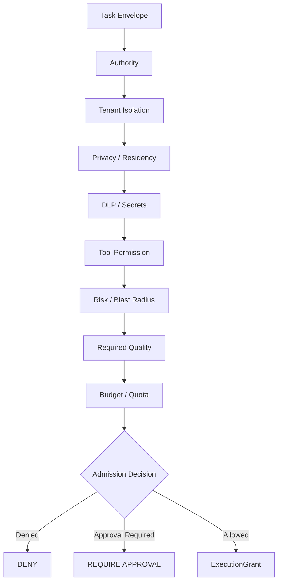

## Admission Output

An admitted task produces a scoped `ExecutionGrant`.

The grant must bind at minimum:

- principal;
- tenant;
- project;
- job/task;
- allowed capability;
- allowed tools;
- allowed resources;
- expiration;
- risk/policy state;
- budget envelope.

---

# 10. Human Approval Node

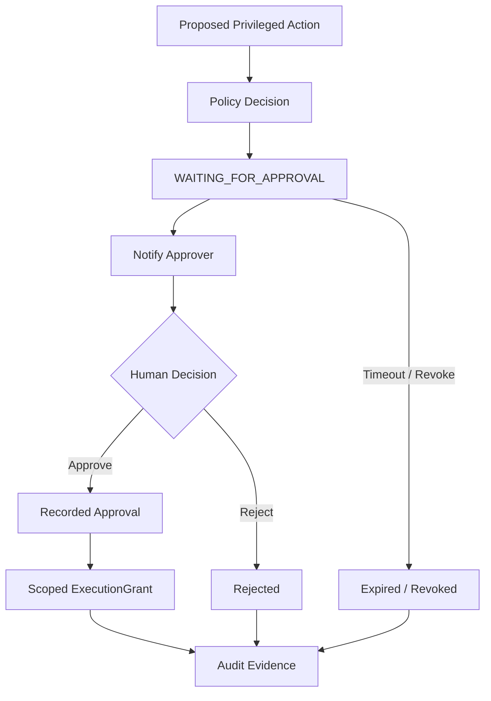

Typical approval candidates:

- production deployment;
- payment / external spend;
- DNS changes;
- destructive data operation;
- privileged identity/security change;
- external email/send action when policy requires;
- production publishing.

---

# 11. ONE RoutingDecision Node

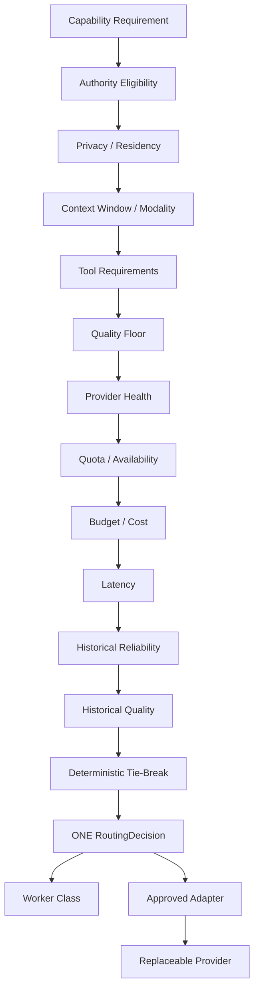

## Routing Invariants

- One routing truth.
- Policy/security eligibility is evaluated before cost optimization.
- Provider-specific code remains behind adapters.
- Providers do not own routing authority.
- External routing projects may be references, not a second brain.
- Local, hosted, and external providers are all replaceable execution resources.

---

# 12. Worker / Skill / Tool / Provider Node Model

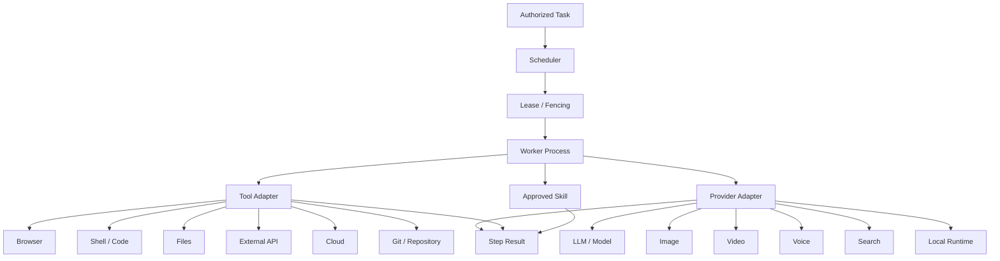

## Concept Separation

```text
CAPABILITY = what can be done
SKILL      = bounded expertise / behavior contract
AGENT      = governed coordinating role
WORKER     = execution process
TOOL       = bounded actuator
PROVIDER   = replaceable model/service/resource
ADAPTER    = ILAIOS ↔ external/local implementation boundary
FACTORY    = bounded domain workflow / DAG
```

---

# 13. Step-Level Autonomous Execution Loop

Every DAG node follows this pattern.

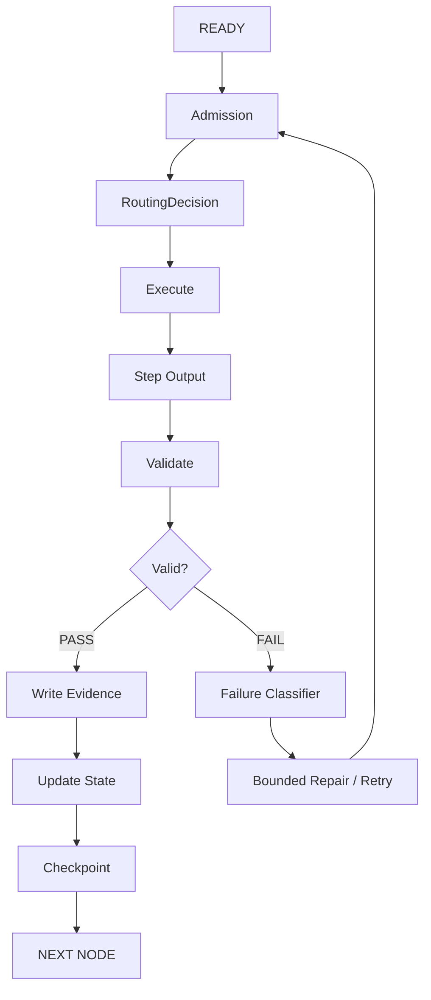

This is the atomic autonomous execution pattern of ILAIOS.

---

# 14. Runtime State Machine

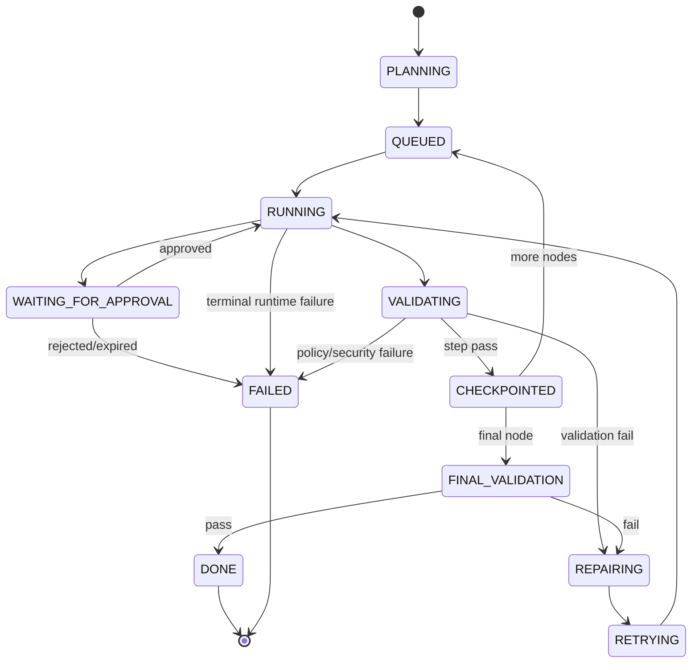

## Minimum Runtime States

```text
PLANNING
QUEUED
RUNNING
WAITING_FOR_APPROVAL
VALIDATING
CHECKPOINTED
REPAIRING
RETRYING
FINAL_VALIDATION
DONE
FAILED
```

---

# 15. Checkpoint / Resume Node

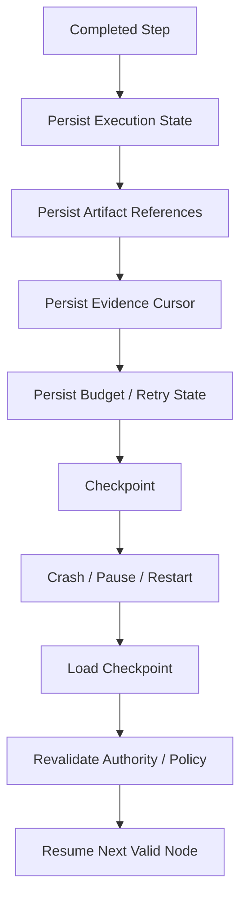

## Resume Rule

A checkpoint never means old authorization remains valid forever.

Before resume:

- current identity/policy must be revalidated when required;
- expired grants must not be reused;
- budget/retry limits must be reloaded;
- immutable artifact/evidence references must be preserved.

---

# 16. Evaluation / Repair Node Loop

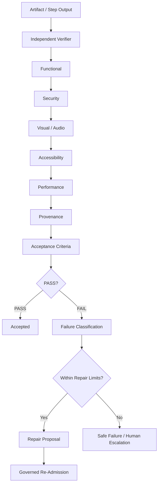

Hard limits:

```text
max_attempts
max_cost
max_elapsed_time
```

Producer and verifier should be independent where feasible.

---

# 17. Continuous Evidence Node Chain

Evidence is generated throughout execution, not only at the end.

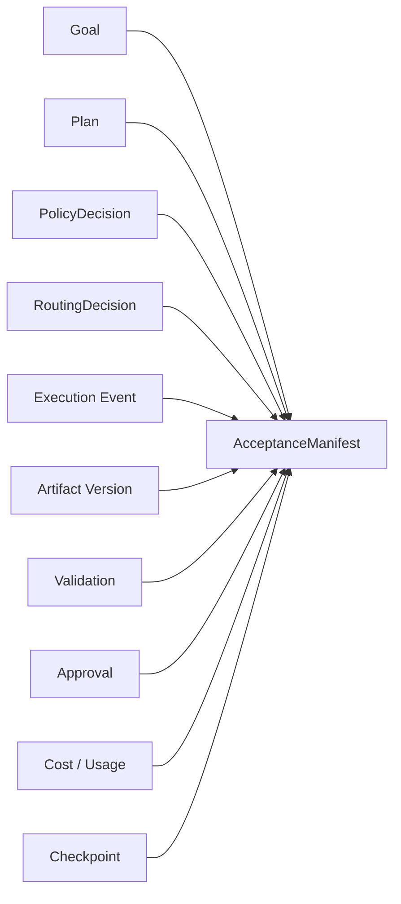

Final evidence must be able to answer:

```text
Who requested this?
Which tenant/project?
What goal?
Which plan?
Which permissions?
Which route?
Which worker?
Which skill/tool/provider?
Which inputs?
Which artifact version?
Which validations?
Which approvals?
Which cost?
Which checksum?
Why was it accepted?
```

---

# 18. Client / Projection Node Model

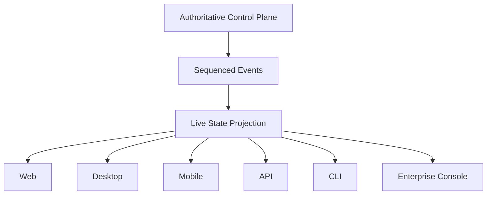

## Projection Rule

Clients may display:

- Planning
- Queued
- Running
- Waiting Approval
- Routing
- Executing
- Validating
- Retrying
- Repairing
- Failed
- Done

But UI state does not become authoritative execution state.

---

# 19. Web Factory Node Topology

```mermaid
flowchart TD
    GOAL["Website Goal"]
    RESEARCH["W01 Research"]
    IA["W02 Information Architecture"]
    COPY["W03 Copy"]
    DESIGN_SYS["W04 Design System"]
    DESIGN["W05 Visual Design"]
    BUILD["W06 Implementation"]
    BROWSER["W07 Browser QA"]
    SECURITY["W08 Security QA"]
    ACCESS["W09 Accessibility"]
    PERF["W10 Performance"]
    SEO["W11 SEO"]
    VISUAL["W12 Visual QA"]
    ACCEPT{"W13 Acceptance?"}
    REPAIR["W14 Repair"]
    DEPLOY["W15 Deployment Validation"]
    FINAL["FINISHED WEBSITE"]

    GOAL --> RESEARCH --> IA --> COPY --> DESIGN_SYS --> DESIGN --> BUILD
    BUILD --> BROWSER --> SECURITY --> ACCESS --> PERF --> SEO --> VISUAL --> ACCEPT
    ACCEPT -->|FAIL| REPAIR --> BROWSER
    ACCEPT -->|PASS| DEPLOY --> FINAL
```

Every Web Factory node still passes through the shared:

```text
Execution Admission
→ RoutingDecision
→ Worker
→ Evidence
→ State
→ Checkpoint
```

path.

---

# 20. Video Factory Node Topology

```mermaid
flowchart TD
    GOAL["Video Goal"]
    RESEARCH["V01 Research"]
    CONCEPT["V02 Concept"]
    SCRIPT["V03 Script"]
    STORY["V04 Storyboard"]
    SHOTS["V05 Shot Plan"]
    GEN["V06 Generation / Acquisition"]
    ASSET["V07 Assets"]
    VOICE["V08 Voice"]
    MUSIC["V09 Music"]
    SFX["V10 SFX"]
    CAPTION["V11 Captions"]
    TIMELINE["V12 Canonical Timeline"]
    EDIT["V13 Editing"]
    MIX["V14 Mix"]
    RENDER["V15 Render"]
    VQA["V16 Video QA"]
    AQA["V17 Audio QA"]
    ACCEPT{"V18 Acceptance?"}
    REPAIR["V19 Repair"]
    EVID["V20 Evidence"]
    FINAL["FINAL VIDEO"]

    GOAL --> RESEARCH --> CONCEPT --> SCRIPT --> STORY --> SHOTS --> GEN --> ASSET
    ASSET --> VOICE --> MUSIC --> SFX --> CAPTION --> TIMELINE --> EDIT --> MIX --> RENDER
    RENDER --> VQA --> AQA --> ACCEPT
    ACCEPT -->|FAIL| REPAIR --> EDIT
    ACCEPT -->|PASS| EVID --> FINAL
```

Existing ILAIOS timeline / FFmpeg / Remotion lineage remains authoritative. External editing projects are references, not a second video runtime.

---

# 21. Cross-Factory Autonomous Composition

One user goal may require more than one factory.

```mermaid
flowchart TD
    GOAL["Compound Goal"]
    PLAN["Bounded Cross-Factory DAG"]

    RESEARCH["Research / Data"]
    WEB["Web Factory"]
    VIDEO["Video Factory"]
    SOFTWARE["Software / App"]
    DOCS["Creative / Document"]
    SECURITY["Security Factory"]

    MERGE["Artifact Composition"]
    VERIFY["Cross-Factory Evaluation"]
    FINAL["Finished Product Bundle"]

    GOAL --> PLAN
    PLAN --> RESEARCH
    PLAN --> WEB
    PLAN --> VIDEO
    PLAN --> SOFTWARE
    PLAN --> DOCS
    PLAN --> SECURITY

    RESEARCH --> MERGE
    WEB --> MERGE
    VIDEO --> MERGE
    SOFTWARE --> MERGE
    DOCS --> MERGE
    SECURITY --> MERGE

    MERGE --> VERIFY --> FINAL
```

## Cross-Factory Rule

Cross-factory work is coordinated by the shared Control Plane and bounded DAG.

Factories must not directly create hidden dependencies on one another.

---

# 22. Example — “Mobilya şirketim için premium site yap”

```mermaid
flowchart TD
    U["User"]
    P["Prompt: Premium mobilya sitesi yap"]
    AUTH["Auth / Tenant / Project"]
    GOAL["Goal + Acceptance"]
    CONTEXT["Brand + Business + Authorized Research"]
    PLAN["Bounded Web DAG"]
    CAP["Capabilities"]
    FACTORY["Web Factory"]
    POLICY["Admission"]
    ROUTE["RoutingDecision"]
    EXEC["Governed Workers"]
    BUILD["Website Artifact"]
    QA["Browser + Security + A11y + Performance + Visual QA"]
    CHECK{"Acceptance PASS?"}
    REPAIR["Bounded Repair"]
    EVID["Evidence + Provenance"]
    DELIVERY["Preview / Deploy Policy"]
    DONE["FINISHED PREMIUM WEBSITE"]

    U --> P --> AUTH --> GOAL --> CONTEXT --> PLAN --> CAP --> FACTORY --> POLICY --> ROUTE --> EXEC --> BUILD --> QA --> CHECK
    CHECK -->|FAIL| REPAIR --> POLICY
    CHECK -->|PASS| EVID --> DELIVERY --> DONE
```

The user sees one request.

ILAIOS internally resolves:

```text
research
→ architecture
→ copy
→ design
→ implementation
→ testing
→ validation
→ repair
→ evidence
→ delivery
```

without requiring the user to manually choose agents, models, tools, or providers.

---

# 23. Core Bypass — Node-Level Red Line

```mermaid
flowchart LR
    FACTORY["Factory Node"]
    ADMIT["Execution Admission"]
    ROUTE["RoutingDecision"]
    WORKER["Worker"]
    ADAPTER["Adapter"]
    PROVIDER["Provider"]

    FACTORY --> ADMIT --> ROUTE --> WORKER --> ADAPTER --> PROVIDER

    FACTORY -. "FORBIDDEN" .-> PROVIDER
    FACTORY -. "FORBIDDEN" .-> ADAPTER
    WORKER -. "FORBIDDEN: unapproved" .-> PROVIDER
```

Required path:

```text
Factory
→ Execution Admission
→ RoutingDecision
→ Worker
→ Approved Adapter
→ Provider
```

---

# 24. External Reference Assimilation Nodes

```mermaid
flowchart TD
    REF["External Reference"]
    PIN["Pin Repository + Commit / Tag"]
    LICENSE["License Review"]
    SECURITY["Supply-Chain Review"]
    STUDY["Architecture / UX / Behavior Study"]
    EXTRACT["Requirement Extraction"]
    SPEC["ILAIOS Specification"]
    NATIVE["ILAIOS-Native Implementation"]
    TEST["Tests"]
    EVAL["Independent Evaluation"]
    PROV["Provenance"]
    REGISTER["Capability Registration"]

    REF --> PIN --> LICENSE --> SECURITY --> STUDY --> EXTRACT --> SPEC --> NATIVE --> TEST --> EVAL --> PROV --> REGISTER
```

External references produce knowledge and requirements.

They do not automatically become:

- Core;
- runtime authority;
- permanent provider;
- permanent skill runtime;
- hidden dependency.

---

# 25. Node Contract Template

Every autonomous node should be specifiable using the following form.

```text
NODE_ID
│
├─ Responsibility
│  └─ Exact bounded responsibility
│
├─ Input Contract
│  └─ Required typed input
│
├─ Output Contract
│  └─ Produced typed output
│
├─ Authority
│  └─ What this node is allowed to decide
│
├─ Required Context
│  ├─ Principal
│  ├─ Tenant
│  ├─ Project
│  └─ Job / Task
│
├─ Policy Requirements
│  └─ Admission / permissions / privacy / budget
│
├─ Evidence
│  └─ Evidence records this node must emit
│
├─ State Transition
│  └─ Allowed runtime state transitions
│
├─ Failure Behavior
│  └─ Retry | Repair | Deny | Escalate | Fail Closed
│
└─ Invariants
   ├─ What cannot bypass this node
   ├─ What this node cannot authorize
   ├─ What it cannot persist
   └─ What must fail closed
```

---

# 26. Canonical Autonomous Execution Formula

```mermaid
flowchart LR
    A["USER INTENT"]
    B["GOAL + ACCEPTANCE"]
    C["AUTHORIZED CONTEXT"]
    D["BOUNDED DAG"]
    E["CAPABILITY RESOLUTION"]
    F["FACTORY ORCHESTRATION"]
    G["EXECUTION ADMISSION"]
    H["APPROVAL IF REQUIRED"]
    I["ONE ROUTING DECISION"]
    J["WORKER + SKILL + TOOL + PROVIDER"]
    K["STEP VALIDATION"]
    L["EVIDENCE + STATE + CHECKPOINT"]
    M["NEXT DAG NODE"]
    N["FINAL ARTIFACT"]
    O["INDEPENDENT EVALUATION"]
    P["BOUNDED REPAIR"]
    Q["FINAL EVIDENCE"]
    R["DELIVERY"]
    S["VERIFIED FINISHED PRODUCT"]

    A --> B --> C --> D --> E --> F --> G --> H --> I --> J --> K --> L --> M
    M -->|more work| F
    M -->|complete| N --> O
    O -->|FAIL| P --> G
    O -->|PASS| Q --> R --> S
```

---

# 27. ILAIOS Autonomous System Identity

```text
ILAIOS
=
Authoritative Control Plane
+ Constitutional Core
+ Governed Platform Capabilities
+ Native Factories
+ Bounded Autonomous DAG Execution
+ Single Routing Truth
+ Replaceable Workers / Tools / Providers
+ Human Approval Where Required
+ Step-Level Validation
+ Continuous Evidence
+ Durable State / Checkpoint / Resume
+ Independent Final Evaluation
+ Bounded Repair
+ Verified Finished Product
```

The user experiences:

```text
SIGN IN
→ ONE PROMPT
→ RESULT
```

ILAIOS internally performs:

```text
UNDERSTAND
→ PLAN
→ AUTHORIZE
→ RESOLVE
→ ORCHESTRATE
→ ROUTE
→ EXECUTE
→ VALIDATE
→ RECORD
→ CHECKPOINT
→ REPAIR WHEN BOUNDED
→ VERIFY
→ DELIVER
```

No external model, tool, routing proxy, agent framework, skill repository, or editing application becomes a second ILAIOS brain.
