# ILAIOS — MASTER SYSTEM ARCHITECTURE

**Document Type:** Canonical System Architecture Diagram Set  
**Format:** GitHub Markdown + Mermaid  
**Status:** Canonical Baseline v1.0 — Published in Repository  
**Core Principle:** **SIGN IN → ONE PROMPT → VERIFIED FINISHED PRODUCT**  
**Authority:** This is the first foundational ILAIOS canonical architecture document. It defines target architecture, authority boundaries, execution invariants and canonical system relationships.

**Important:** Architecture defines the target system. It does **not** by itself prove that every component is already implemented or production-deployed.

---

# 00. How to Read This Document

This document is intentionally **diagram-first**.

Every major architectural area uses the same structure:

1. **Diagram** — how the parts connect.
2. **Responsibility** — what the component owns.
3. **Contract** — required input/output boundary.
4. **Rules / Invariants** — what must never be bypassed or duplicated.

The system must preserve these global invariants:

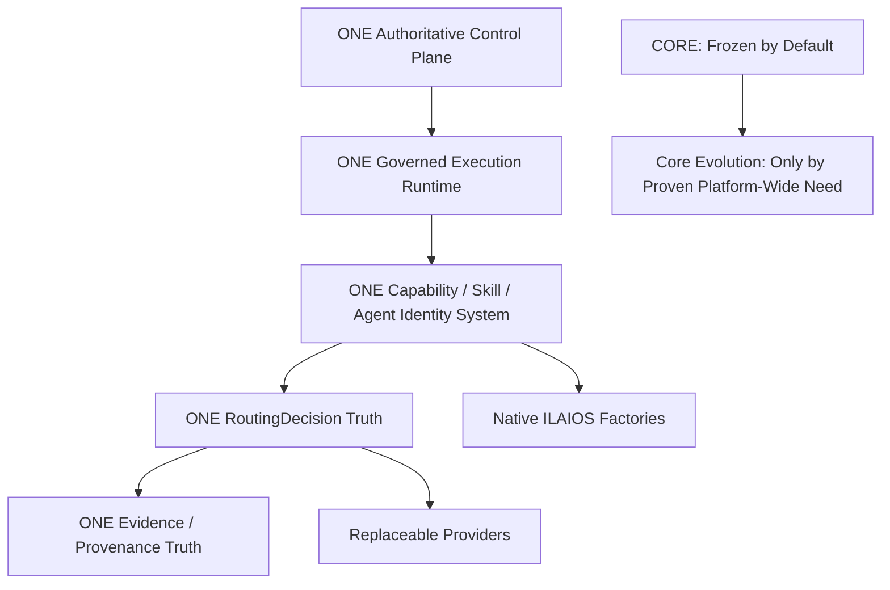

### Core Evolution Constitutional Rule

**ILAIOS Core is FROZEN BY DEFAULT, EVOLVABLE BY PROOF.**

Core may evolve only when repository evidence proves that a platform-wide invariant or canonical contract cannot be correctly implemented inside an existing governed capability boundary. Convenience is not sufficient justification. Factory logic, provider logic, model logic, domain-specific intelligence, UI behavior and replaceable integrations must not be promoted into Core merely to simplify implementation.

Any approved Core evolution must extend the single existing Core. It must never create a second Core, second Control Plane, second runtime authority, second Planner, second Capability Registry, parallel policy authority, parallel routing authority or parallel evidence truth.

**Forbidden:** second Core, second Planner, second Capability Registry, second Agent Runtime, parallel policy engine, parallel routing authority, factory-specific hidden runtime, provider-specific authority leakage, infinite repair loop.

---

# 01. System Context

## Diagram

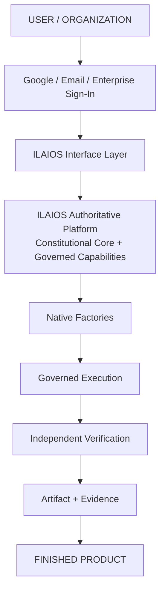

## Responsibility

ILAIOS converts a user goal into a governed, verified final artifact.

## Contract

**Input:** authenticated user intent.  
**Output:** verified final artifact + evidence.

## Rules / Invariants

- User does not need to select a model, agent, skill or provider.
- Permanent product logic belongs to ILAIOS.
- Providers remain replaceable.
- A final artifact is not accepted before mandatory verification passes.

---

# 02. Product / Platform Boundary

## Diagram

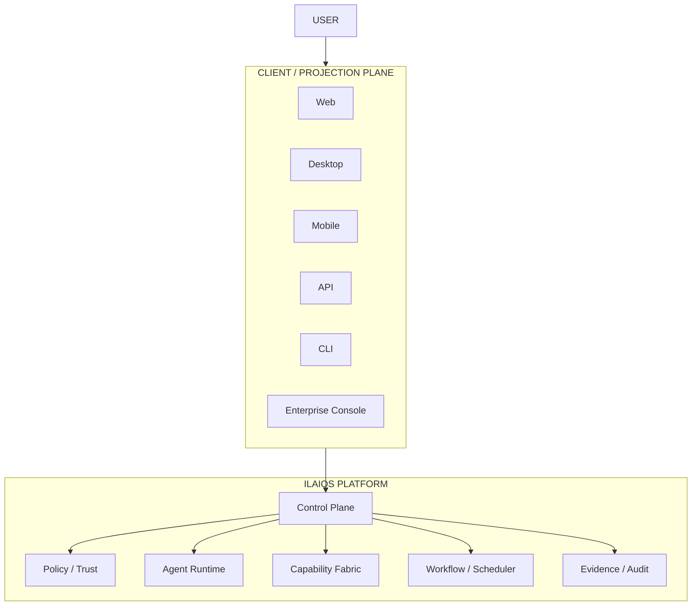

## Responsibility

Clients present and control ILAIOS. The platform owns authoritative state and execution decisions.

## Contract

**Client → Platform:** authenticated requests, approvals, user input.  
**Platform → Client:** state projection, results, evidence, notifications.

## Rules / Invariants

- Web/Desktop/Mobile are **not** authoritative execution state.
- UI may display agents, jobs and progress but cannot become execution authority.
- Client state may be recreated from authoritative platform state.

---

# 03. ILAIOS Constitutional Core and Governed Platform Capabilities

## Diagram

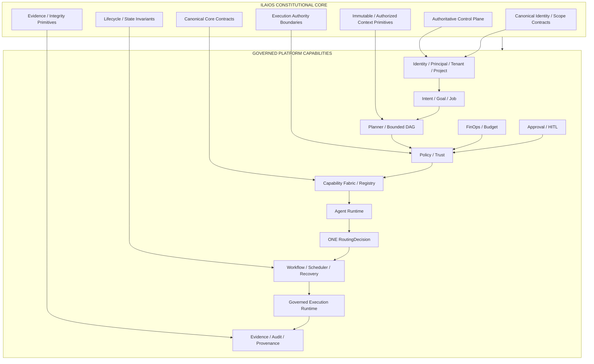

## Responsibility

The **Constitutional Core** owns only the platform-wide authority and invariants that must remain true across every domain: authoritative control, canonical identities and scopes, lifecycle/state semantics, execution authority boundaries, immutable/authorized context primitives, evidence integrity primitives and Core contracts.

The surrounding **Governed Platform Capabilities** implement planning, policy, routing, agent/runtime behavior, scheduling, FinOps, approvals and evidence services under those Core contracts. They are governed platform capabilities, not justification for expanding Core.

## Contract

**Core input:** authenticated platform events and canonical contexts.  
**Core output:** enforceable authority/state/contracts that governed platform capabilities must obey.

**Platform input:** `GoalSpec + PrincipalContext + TenantContext + ProjectContext + AuthorizedContext`.  
**Platform output:** governed executable work, authoritative state transitions and evidence-backed results.

## Rules / Invariants

- **Core is frozen by default and evolvable only by proof.**
- A Core change requires a demonstrated platform-wide invariant or canonical-contract need that cannot be correctly contained in an existing governed capability.
- Factory, provider, model, UI and domain-specific intelligence do not belong in Core.
- No factory or capability may create a second Core, Control Plane, Planner, runtime authority, routing truth or evidence truth.
- No domain may bypass Policy / Trust, authoritative state transitions or evidence requirements.
- Routing remains one governed platform truth; provider-specific logic stays behind adapters.
- Evidence must be generated through the authoritative evidence chain.

---

# 04. Request Execution Flow

## Diagram

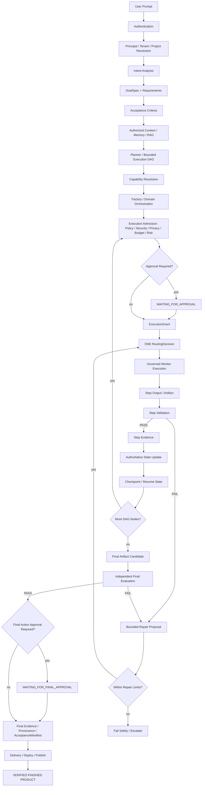

## Responsibility

This is the canonical user-goal execution lifecycle from sign-in to a verified finished product. It combines planning, authorized context, capability/factory orchestration, per-step admission, routing, execution, validation, continuous evidence, durable state/checkpointing, independent final evaluation, bounded repair and conditional human approval.

## Contract

**Input:** authenticated natural-language goal.  
**Output:** verified finished artifact/action satisfying explicit acceptance criteria, plus authoritative evidence and provenance.

## Rules / Invariants

- Acceptance criteria are established before execution and remain traceable to final acceptance.
- Factory/domain orchestration occurs before worker/provider routing.
- Every executable DAG node passes execution admission before it can receive an `ExecutionGrant`.
- Human approval is a conditional pre-action gate, not merely a final-stage ceremony.
- Material steps generate evidence, authoritative state updates and checkpoints during execution, not only at the end.
- Context retrieval must be authorized before it enters planning or execution.
- Repair is bounded by attempts, cost and elapsed time.
- Policy/security failures are not repaired around.
- Final delivery requires independent verification PASS and any required final-action approval.
- A crash, pause or provider failure must not silently reset the job; execution resumes from governed state/checkpoints when policy permits.

---

# 05. Agent Runtime

## Diagram

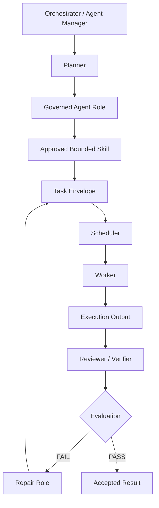

## Responsibility

Agents coordinate governed work. Workers execute bounded tasks.

## Contract

**Agent input:** task + capability contract + authorized context.  
**Agent output:** bounded task requests or evaluation decisions.

## Rules / Invariants

- **Agent ≠ Worker.**
- **Skill ≠ Agent.**
- A new skill does not automatically create a new agent.
- Agents cannot grant themselves permissions.
- Verifier should be independent from producer where feasible.

---

# 06. Policy Gateway

## Diagram

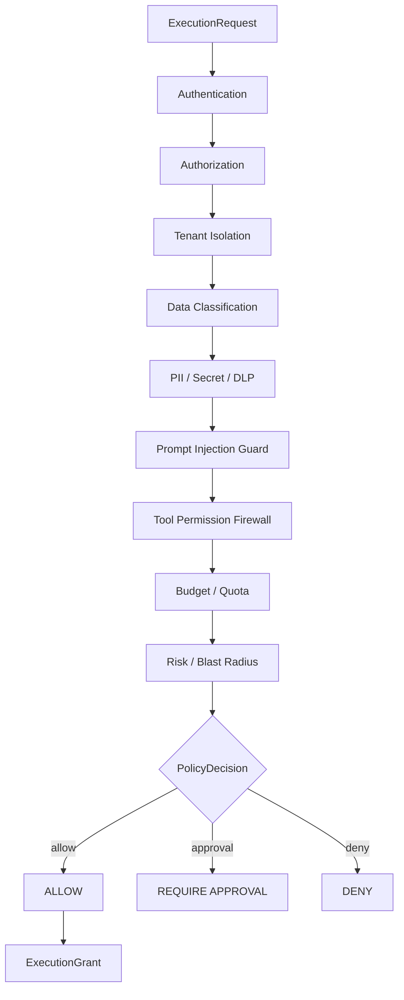

## Responsibility

Policy Gateway decides whether an execution is allowed, denied or requires human approval.

## Contract

**Input:** `ExecutionRequest`.  
**Output:** `Allow | Deny | RequireApproval`, optionally `ExecutionGrant`.

## Rules / Invariants

- Cannot be bypassed.
- Tenant context is mandatory.
- Every material decision generates audit evidence.
- High-risk actions may require approval.
- Policy decisions must fail closed when required context is missing.

---

# 07. Model / Provider Routing

## Diagram

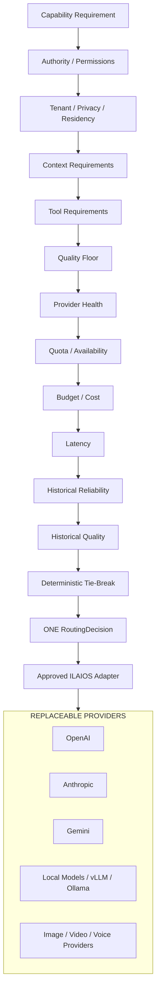

## Responsibility

Select the best permitted execution resource without leaking provider-specific logic into product behavior.

## Contract

**Input:** `CapabilityRequirement + PolicyContext + ProviderState`.  
**Output:** `RoutingDecision`.

## Rules / Invariants

- There is only **one routing truth**.
- Provider choice cannot override privacy/security requirements.
- Provider health and budget are inputs, not authorities.
- External routing projects such as OmniRoute may be studied, but are not mandatory runtime authority.
- Provider-specific code lives behind adapters.

---

# 08. Tool Execution

## Diagram

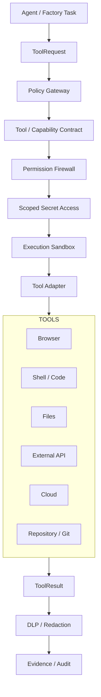

## Responsibility

Execute tools under explicit permission, isolation and evidence boundaries.

## Contract

**Input:** `ToolRequest + ExecutionGrant`.  
**Output:** `ToolResult + EvidenceRecord`.

## Rules / Invariants

- No raw unrestricted shell/browser/tool access.
- Secrets are scoped to the specific execution need.
- Tool results are treated as untrusted content until validated.
- Sensitive data is redacted before broad telemetry exposure.
- Destructive tool operations may require approval.

---

# 09. Data Architecture

## Diagram — Logical Entity Chain

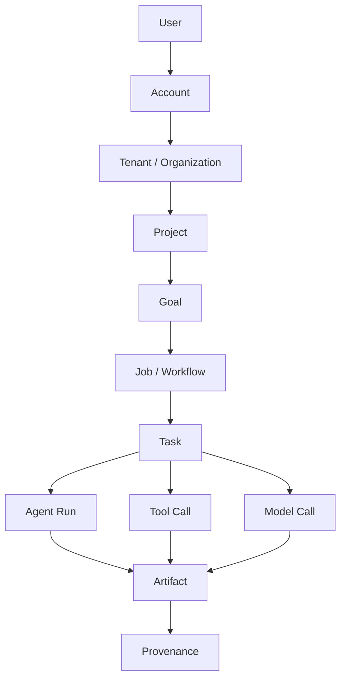

## Diagram — Physical / Logical Stores

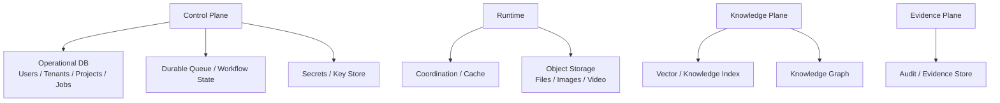

## Responsibility

Persist operational state, knowledge, artifacts, evidence and secrets under tenant-aware boundaries.

## Contract

Every persisted record must resolve to its owner/context and lifecycle metadata.

## Rules / Invariants

- Tenant identity must be preserved across all stores.
- Object storage and vector retrieval cannot rely on client-side filtering.
- Secrets are not stored with ordinary application data.
- Evidence records must be tamper-evident or integrity-verifiable.

---

# 10. Memory / RAG / Knowledge

## Diagram

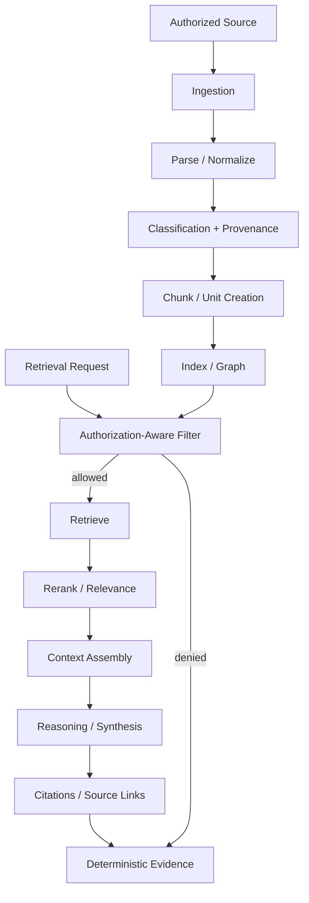

## Responsibility

Provide grounded, authorized context without cross-tenant leakage.

## Contract

**Input:** `RetrievalRequest + PrincipalContext + TenantContext + Purpose`.  
**Output:** authorized context units + provenance.

## Rules / Invariants

- Unauthorized retrieval is a security violation.
- Every retrieved unit must retain source provenance.
- RAG is not “just embeddings” or “just a vector database”.
- Knowledge retrieval must be authorization-aware.
- Current architectural expansion priority: **RAG / Knowledge foundation first**.

---

# 11. Security Architecture

## Diagram

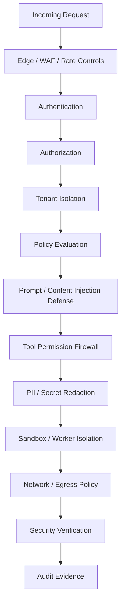

## Responsibility

Protect identity, tenants, data, execution, tools, secrets and output delivery.

## Contract

Every execution carries security context from ingress through evidence.

## Rules / Invariants

- Security controls are layered; no single guard is sufficient.
- Tenant boundary must survive queues, workers, caches and storage.
- Untrusted content never becomes trusted instruction automatically.
- Privileged actions require stronger policy controls.
- Security verification is independent from artifact generation.

---

# 12. Tenant Isolation

## Diagram

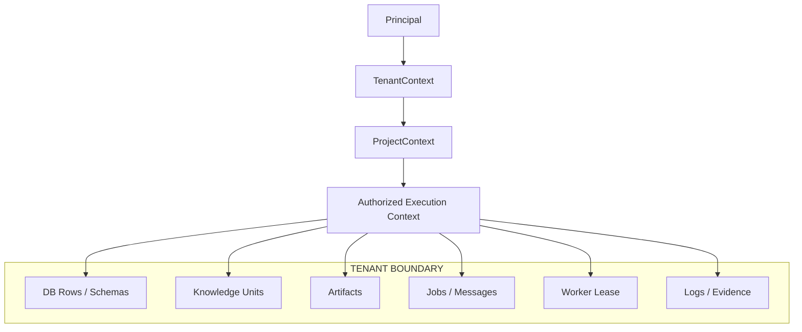

## Responsibility

Keep one tenant's data, context, artifacts and execution inaccessible to another tenant.

## Contract

All protected operations require valid `PrincipalContext + TenantContext + ProjectContext`.

## Rules / Invariants

- No “tenant inferred from UI”.
- Queue messages must carry scoped identity/context.
- Worker leases are tenant-scoped.
- Retrieval filters are enforced server-side.
- Cross-tenant access is denied by default.

---

# 13. Artifact / Provenance / Evidence

## Diagram

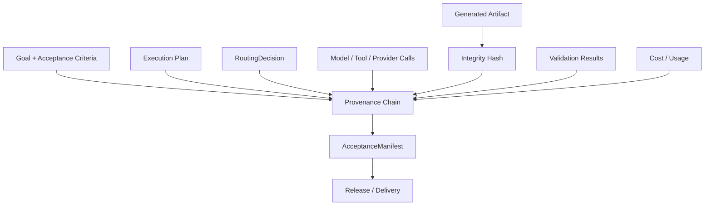

## Responsibility

Explain exactly how an artifact was produced, validated and approved.

## Contract

**Input:** execution events + artifact.  
**Output:** provenance chain + validation evidence + acceptance manifest.

## Rules / Invariants

- Evidence is part of the product, not optional logging.
- Artifacts should be integrity-verifiable.
- Validation evidence is linked to the exact artifact version.
- Release status cannot be inferred from architecture alone.

---

# 14. Approval System / HITL

## Diagram

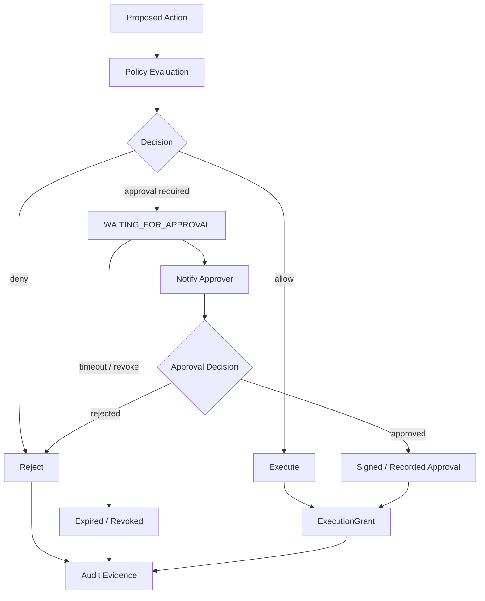

## Responsibility

Insert human authorization only where policy/risk requires it.

## Contract

**Input:** high-risk `ActionRequest`.  
**Output:** approved grant, rejection or expiration.

## Rules / Invariants

- Agents cannot self-approve.
- Approval is tied to the exact scoped action.
- Approval may expire or be revoked.
- Production, payment, DNS or destructive actions may require explicit approval policy.

---

# 15. Observability

## Diagram

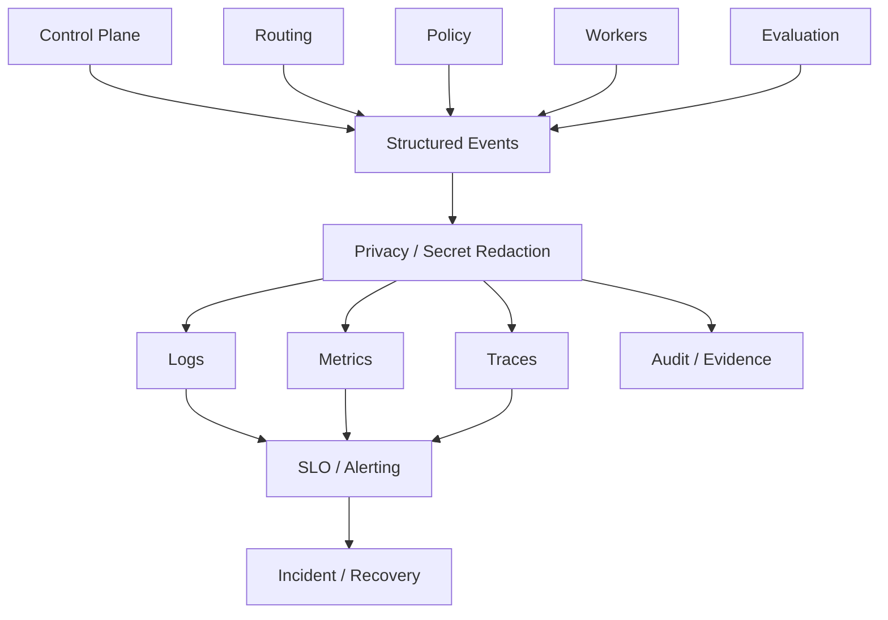

## Responsibility

Provide operational visibility without leaking protected content.

## Contract

Execution components emit structured events. Observability converts them into logs, metrics, traces and alerts.

## Rules / Invariants

- Sensitive data must be redacted before broad telemetry exposure.
- Audit evidence is not the same as debug logs.
- Alerting must be tied to measurable failure/SLO conditions.
- Observability cannot modify execution authority.

---

# 16. Failure / Recovery / Bounded Repair

## Diagram

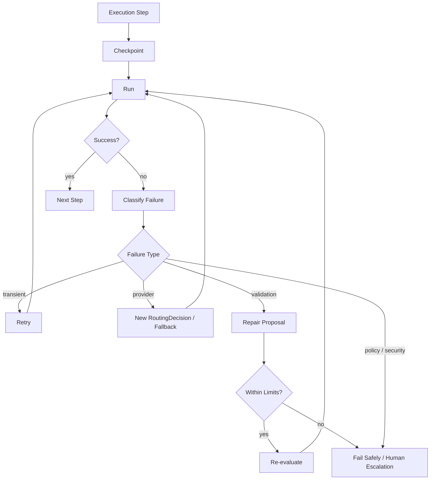

## Responsibility

Recover from bounded failures without uncontrolled loops.

## Contract

**Input:** failure event + retry/repair policy.  
**Output:** resumed execution, safe failure or escalation.

## Rules / Invariants

Hard bounds:

```text
max_attempts
max_cost
max_elapsed_time
```

- Infinite retry is forbidden.
- Policy/security failures do not get silently “repaired around”.
- Fallback still requires policy and routing approval.
- Checkpoints must preserve enough state for deterministic recovery where required.

---

# 17. Deployment Architecture

## Diagram

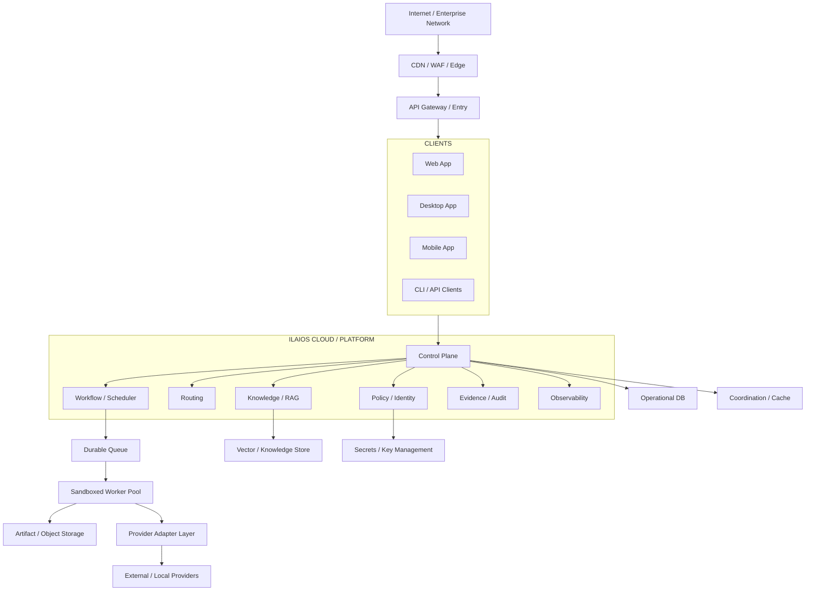

## Responsibility

Separate client surfaces, authoritative control, durable orchestration, isolated execution, data stores and replaceable providers.

## Contract

Clients speak to platform APIs. Workers receive bounded jobs. Providers are reached only through approved adapters.

## Rules / Invariants

- User device is not the default authoritative backend.
- Workers are isolated from Control Plane authority.
- Secrets are not embedded in clients or jobs.
- This is a target logical deployment architecture, not proof of current live deployment.

---

# 18. Web Factory

## Diagram

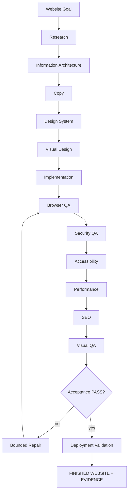

## Responsibility

Produce a complete website from a user outcome, not a partial mockup.

## Contract

**Input:** website goal + brand/business context + acceptance criteria.  
**Output:** deployable website artifact + QA/evidence.

## Rules / Invariants

- Factory uses Core policy/routing/evidence.
- Factory does not create its own provider router.
- Design intelligence is ILAIOS-native.
- External design skill repositories may be references, not production runtime dependencies.

---

# 19. Video / Media Factory

## Diagram

```mermaid
flowchart TD
    GOAL["Video Goal"]
    RESEARCH["Research"]
    CONCEPT["Concept"]
    SCRIPT["Script"]
    STORY["Storyboard"]
    SHOTS["Shot Plan"]
    GEN["Generation / Acquisition"]
    ASSETS["Asset Management"]
    VOICE["Voice"]
    MUSIC["Music"]
    SFX["SFX"]
    CAP["Captions"]
    TIMELINE["Canonical Timeline"]
    EDIT["ILAIOS video.edit.*"]
    MIX["Mix"]
    RENDER["FFmpeg / Remotion / Render"]
    VQA["Video QA"]
    AQA["Audio QA"]
    CHECK{"Acceptance PASS?"}
    REPAIR["Bounded Repair"]
    EVID["Evidence"]
    FINAL["FINAL VIDEO"]

    GOAL --> RESEARCH --> CONCEPT --> SCRIPT --> STORY --> SHOTS --> GEN --> ASSETS --> VOICE --> MUSIC --> SFX --> CAP --> TIMELINE --> EDIT --> MIX --> RENDER --> VQA --> AQA --> CHECK
    CHECK -->|no| REPAIR --> EDIT
    CHECK -->|yes| EVID --> FINAL
```

## Responsibility

Produce a finished, validated video through the existing ILAIOS Video Factory lineage.

## Contract

**Input:** video goal + duration/style/business constraints + acceptance criteria.  
**Output:** final rendered video + evidence.

## Rules / Invariants

- Existing canonical timeline is preserved.
- FFmpeg / Remotion / existing render/evidence lineage is preserved.
- OpenCut may provide editing-UX/behavior references only.
- No second Video Engine.

---

# 20. Other Capability / Factory Families

## Diagram

```mermaid
flowchart TD
    CORE["ILAIOS Core + Capability Fabric"]

    CORE --> KNOW["Knowledge / RAG"]
    CORE --> SOFTWARE["Software Factory"]
    CORE --> APP["App Factory"]
    CORE --> RESEARCH["Research / Data"]
    CORE --> SECURITY["Security Factory"]
    CORE --> CREATIVE["Creative / Document"]
    CORE --> COMMERCE["Commerce / Growth"]
    CORE --> PERSONAL["Personal Operations / Automation"]

    KNOW --> GOV["Shared Governance / Routing / Evidence"]
    SOFTWARE --> GOV
    APP --> GOV
    RESEARCH --> GOV
    SECURITY --> GOV
    CREATIVE --> GOV
    COMMERCE --> GOV
    PERSONAL --> GOV

    GOV --> FINAL["Verified Artifacts / Actions"]
```

## Responsibility

Extend ILAIOS through governed capability families without multiplying platform brains.

## Contract

Each factory declares:

- supported goals;
- required capabilities;
- input/output schemas;
- permissions;
- validation requirements;
- repair policy;
- evidence requirements.

## Rules / Invariants

- Factory = bounded domain DAG.
- Factory ≠ provider.
- Factory ≠ worker.
- Factory ≠ agent.
- All factories share the same Core trust, routing and evidence path.

---

# 21. Core Bypass — Explicitly Forbidden

## Diagram

```mermaid
flowchart LR
    WEB["Web Factory"]
    VIDEO["Video Factory"]
    OTHER["Other Factory"]
    CORE["ILAIOS Core"]
    PROVIDER["Provider / Tool / External System"]

    WEB -->|required| CORE
    VIDEO -->|required| CORE
    OTHER -->|required| CORE
    CORE --> PROVIDER

    WEB -. "FORBIDDEN BYPASS" .-> PROVIDER
    VIDEO -. "FORBIDDEN BYPASS" .-> PROVIDER
    OTHER -. "FORBIDDEN BYPASS" .-> PROVIDER
```

## Responsibility

Make the architectural trust boundary unambiguous.

## Contract

Every external execution must be represented by a governed Core decision.

## Rules / Invariants

A direct factory-to-provider path is invalid unless the Core contract explicitly owns and records that path.

---

# 22. External Reference Assimilation

## Diagram

```mermaid
flowchart TD
    REF["External Open-Source Reference"]
    PIN["Pin Repo + Commit / Tag"]
    LICENSE["License Review"]
    SUPPLY["Security / Supply-Chain Review"]
    STUDY["Architecture / UX / Behavior Study"]
    EXTRACT["Requirement Extraction"]
    SPEC["ILAIOS Specification"]
    NATIVE["ILAIOS-Native Implementation"]
    TEST["ILAIOS Tests"]
    EVAL["Independent Evaluation"]
    PROV["Provenance / Evidence"]
    REG["Capability Registration"]
    RELEASE["Release"]

    REF --> PIN --> LICENSE --> SUPPLY --> STUDY --> EXTRACT --> SPEC --> NATIVE --> TEST --> EVAL --> PROV --> REG --> RELEASE
```

## Responsibility

Learn from external projects without making ILAIOS dependent on their runtime.

## Contract

External reference produces requirements, not execution authority.

## Rules / Invariants

Examples:

- OmniRoute → routing intelligence reference.
- OpenCut → video editing semantics reference.
- NotebookLM-style workflows → RAG / research UX reference.
- Taste / Emil-style skills → design intelligence reference.
- Codex / Claude / Gemini CLI / OpenClaw → development actuators, not released-product brain.

---

# 23. Full End-to-End System Relationship

This diagram is the final summary. It is intentionally larger, but the previous sections are the canonical detailed views.

```mermaid
flowchart TD
    USER["USER"]
    AUTH["SIGN IN"]
    CLIENT["WEB / DESKTOP / MOBILE / API / CLI"]

    subgraph CORE["ILAIOS CONSTITUTIONAL CORE"]
        CP["Authoritative Control Plane"]
        CORECON["Core Contracts / Identity / State / Authority / Evidence Invariants"]
    end

    subgraph PLATFORM["GOVERNED PLATFORM CAPABILITIES"]
        ID["Identity / Tenant / Project"]
        GOAL["Intent / Goal / Acceptance"]
        KNOW["Authorized Knowledge / RAG"]
        PLAN["Planner / Bounded DAG"]
        CAP["Capability Fabric"]
        POLICY["Policy / Trust / Admission"]
        HITL["Approval / HITL"]
        AGENT["Agent Runtime"]
        ROUTE["ONE RoutingDecision"]
        WF["Workflow / Scheduler / Recovery"]
        EVID["Evidence / Audit / Provenance"]
    end

    subgraph FACT["NATIVE FACTORIES / DOMAIN ORCHESTRATION"]
        WEBF["Web"]
        VIDF["Video"]
        SOFTF["Software / App"]
        DATAF["Research / Data"]
        SECF["Security"]
        DOCF["Creative / Document"]
        COMF["Commerce / Growth"]
        PERSF["Personal Operations"]
    end

    subgraph EXEC["EXECUTION PLANE"]
        WORKER["Sandboxed Workers"]
        SKILL["Approved Skills"]
        TOOL["Tools"]
        ADAPTER["Provider Adapters"]
        PROVIDER["Replaceable Providers"]
    end

    STEPEVID["Step Evidence + State + Checkpoint"]
    VERIFY["Independent Evaluation"]
    REPAIR["Bounded Repair"]
    ART["Artifact + AcceptanceManifest"]
    DELIVERY["Delivery / Deploy / Publish"]
    FINAL["VERIFIED FINISHED PRODUCT"]

    USER --> AUTH --> CLIENT --> CP --> ID
    CORECON --> PLATFORM
    ID --> GOAL --> KNOW --> PLAN --> CAP
    CAP --> FACT
    FACT --> POLICY
    HITL --> POLICY
    POLICY --> AGENT --> ROUTE --> WF --> WORKER
    WORKER --> SKILL
    WORKER --> TOOL
    WORKER --> ADAPTER --> PROVIDER
    SKILL --> STEPEVID
    TOOL --> STEPEVID
    PROVIDER --> STEPEVID
    STEPEVID --> WF
    WF --> VERIFY
    VERIFY -->|FAIL| REPAIR --> POLICY
    VERIFY -->|PASS| EVID
    EVID --> ART --> DELIVERY --> FINAL
```

### Canonical interpretation

- Core supplies the non-duplicable authority and invariants.
- Governed platform capabilities perform planning, policy, routing, scheduling, knowledge, approvals and evidence services under Core contracts.
- Factories organize domain work before execution admission/routing.
- Workers execute bounded tasks using approved skills, tools and replaceable providers.
- Evidence/state/checkpoints are continuous execution outputs.
- Independent evaluation decides acceptance; bounded repair re-enters governed admission rather than bypassing controls.

---

# 24. Canonical Component Template

Every future architectural component added to this document should use this exact form:

```text
COMPONENT NAME
│
├─ Responsibility
│  └─ What this component owns
│
├─ Input Contract
│  └─ Exact required input concept
│
├─ Output Contract
│  └─ Exact produced output concept
│
└─ Invariants
   ├─ What cannot bypass it
   ├─ What authority it does NOT own
   ├─ What evidence it must produce
   └─ What failure mode must fail closed
```

Example:

```text
POLICY GATEWAY
│
├─ Responsibility
│  └─ Evaluate every governed execution before privileged action
│
├─ Input
│  └─ ExecutionRequest + PrincipalContext + TenantContext
│
├─ Output
│  └─ Allow | Deny | RequireApproval
│
└─ Invariants
   ├─ Cannot be bypassed
   ├─ Tenant context required
   ├─ Audit event required
   └─ Missing mandatory context fails closed
```

---

# 25. Final Architecture Formula

```mermaid
flowchart LR
    A["USER INTENT"]
    B["GOAL + REQUIREMENTS + ACCEPTANCE"]
    C["AUTHORIZED CONTEXT"]
    D["BOUNDED PLAN"]
    E["CAPABILITY RESOLUTION"]
    F["FACTORY / DOMAIN ORCHESTRATION"]
    G["EXECUTION ADMISSION / GOVERNANCE"]
    H["APPROVAL GATE IF REQUIRED"]
    I["ONE ROUTING DECISION"]
    J["WORKER + SKILL + TOOL + PROVIDER / ADAPTER"]
    K["STEP VALIDATION"]
    L["STEP EVIDENCE + STATE + CHECKPOINT"]
    M{"MORE DAG WORK?"}
    N["INDEPENDENT FINAL EVALUATION"]
    O["BOUNDED REPAIR"]
    P["FINAL EVIDENCE / ACCEPTANCE MANIFEST"]
    Q["DELIVERY / DEPLOY / PUBLISH"]
    R["VERIFIED FINISHED PRODUCT"]

    A --> B --> C --> D --> E --> F --> G --> H --> I --> J --> K
    K -->|PASS| L --> M
    M -->|YES| G
    M -->|NO| N
    K -->|FAIL| O --> G
    N -->|FAIL| O
    N -->|PASS| P --> Q --> R
```

### Constitutional Core Rule

**CORE = FROZEN BY DEFAULT, EVOLVABLE BY PROOF.**

The Core changes only when a platform-wide invariant or canonical contract cannot be correctly satisfied within an existing governed capability boundary. Factories, providers, models, domain intelligence and UI projections remain outside the Constitutional Core.

# ILAIOS Architecture Identity

**ILAIOS = Governed Capability Operating System + Native Factories + Deterministic Routing + Independent Evaluation / Repair + Evidence**

The system brain is:

**ILAIOS Constitutional Core + Authoritative Control Plane + Governed Platform Capabilities + Governed Runtime + Capability Fabric + Trust / Governance + Evidence**

No external model, tool, skill repository, routing proxy or editing application becomes a second brain.
